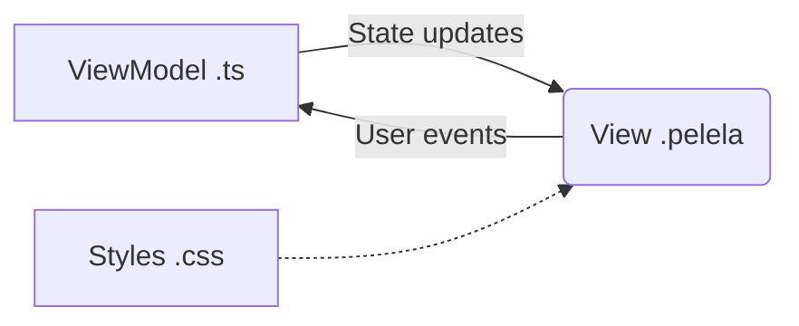
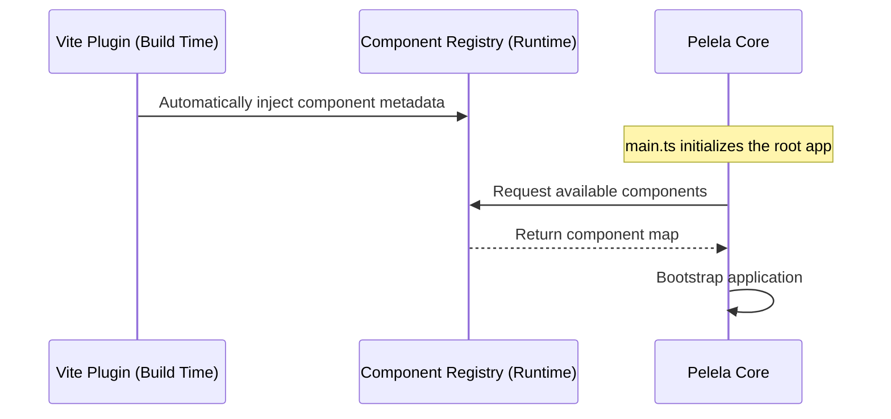
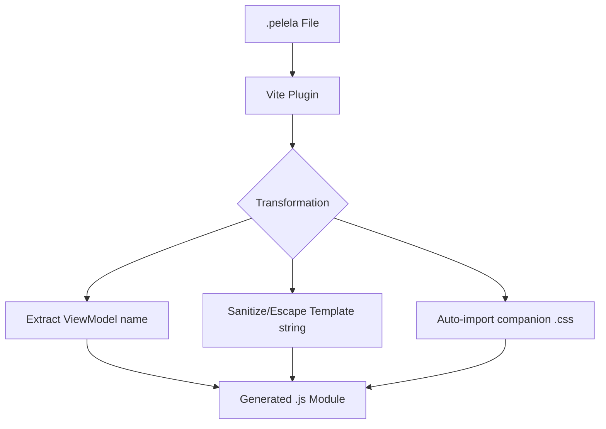

# Architecture & Lifecycle

PelelaJS is designed around a strictly enforced **Model-View-ViewModel (MVVM)** architectural pattern. The core philosophy is that the Model (the domain logic and state) is the single source of truth, and the View simply reflects it declaratively. 

## The Component Triad

Every PelelaJS component is conceptually composed of three parts:

1. **`.pelela` (The View)**: The declarative HTML-like template. It contains bindings but no programmatic code.
2. **`.ts` (The ViewModel / Controller)**: The TypeScript file containing the class that manages the state, behavior, and lifecycle of the component.
3. **`.css` (The Styles)**: Optional styling associated with the component.



*Pros:*
- **Separation of Concerns:** Clear boundary between logic and presentation.
- **Conceptual Clarity:** Easier for students to reason about state vs. DOM.

*Cons:*
- **File Verbosity:** Requires multiple files per component compared to single-file components (SFCs) like in Vue or Svelte.

## Lifecycle and Bootstrapping

The framework lifecycle is designed to be as invisible as possible to the user, favoring convention over configuration.

### Auto-register Mechanism

PelelaJS uses an `auto-register` approach. At build time (via the Vite plugin), all components in a specific structure are automatically discovered and registered in the `ComponentRegistry`.



While manual registration of components and routes is possible under the hood, the framework strongly discourages it to keep the developer experience straightforward and declarative.

## Build-time Transformation (Vite Plugin)

To bridge the gap between the declarative `.pelela` templates and the JavaScript runtime, PelelaJS utilizes a custom Vite plugin that performs a source-to-source transformation.

### The Transformation Process

When the build system encounters a `.pelela` file, the plugin intercepts it and converts it into a standard JavaScript module. This allows the browser to import templates as if they were code.



**Key Outputs of the Transformation:**
- **Default Export**: The sanitized HTML template string.
- **Named Export (`viewModelName`)**: The identifier of the TypeScript class associated with this view.
- **CSS Side-effect**: An automatic `import "./filename.css"` if the file exists, ensuring styles are bundled.

*Example Transformation:*
- **Input (`app.pelela`)**: `<pelela view-model="App">...</pelela>`
- **Output**: 
  ```javascript
  import "./app.css";
  export const viewModelName = "App";
  const template = "...";
  export default template;
  ```

### The Bootstrapping Flow

1. **Initialization**: The developer defines a root view model in `main.ts` and calls the mount function.
2. **Parsing**: The framework parses the main `.pelela` template.
3. **Binding & Reactivity Setup**: The reactive proxies are instantiated for the view model state, and the dependency tracker links DOM nodes to state properties.
4. **Initial Render**: The DOM is updated to reflect the initial state.
5. **Event Loop**: The system waits for user interactions or async operations to trigger state changes, which in turn trigger targeted DOM updates.
