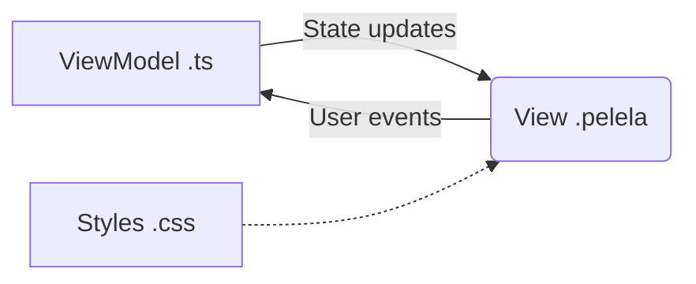
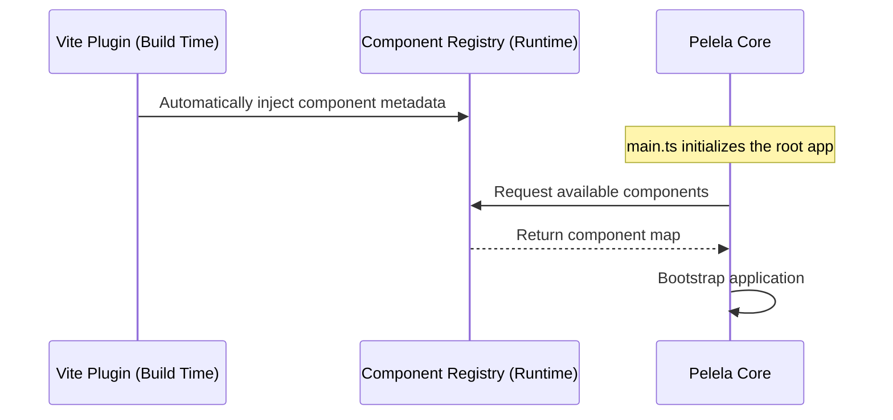
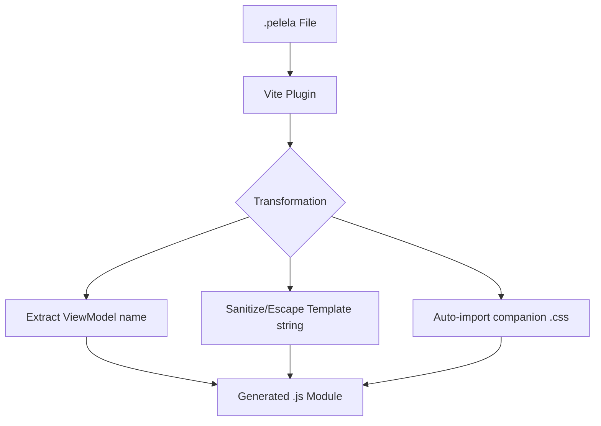
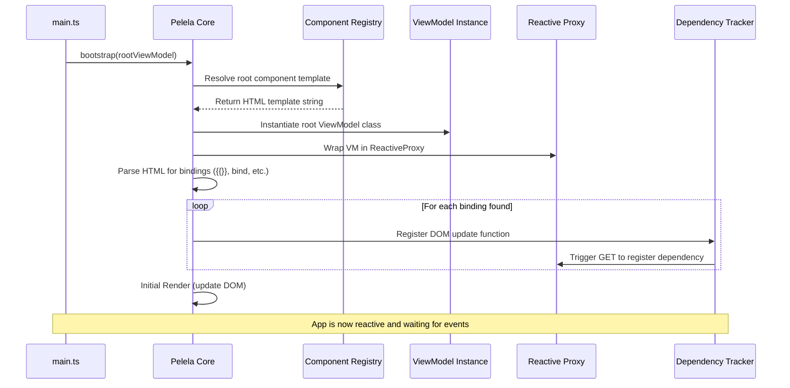

# Architecture & Lifecycle

PelelaJS is designed around a strictly enforced **Model-View-ViewModel (MVVM)** architectural pattern. The core philosophy is that the Model (the domain logic and state) is the single source of truth, and the View simply reflects it declaratively.

## The Component Triad

Every PelelaJS component is conceptually composed of three parts:

1. **`.pelela` (The View)**: The declarative HTML-like template. It contains bindings but no programmatic code.

2. **`.ts` (The ViewModel / Controller)**: The TypeScript file containing the class that manages the state, behavior, and lifecycle of the component.

3. **`.css` (The Styles)**: Optional styling associated with the component.



*Pros:*

- **Separation of Concerns:** Clear boundary between logic and presentation.

- **Conceptual Clarity:** Easier for students to reason about state vs. DOM.

*Cons:*

- **File Verbosity:** Requires multiple files per component compared to single-file components (SFCs) like in Vue or Svelte.

## Lifecycle and Bootstrapping

The framework lifecycle is designed to be as invisible as possible to the user, favoring convention over configuration.

### Auto-register Mechanism

PelelaJS uses an `auto-register` approach. At build time (via the Vite plugin), all components in a specific structure are automatically discovered and registered in the `ComponentRegistry`.



While manual registration of components and routes is possible under the hood, the framework strongly discourages it to keep the developer experience straightforward and declarative.

### How Auto-discovery Works

The auto-discovery is powered by the **Vite plugin**, which scans the `src/` directory at build time looking for `.pelela` files. It dynamically generates a **Virtual Module** (`virtual:pelela-auto-register`) that contains the necessary `import` statements and calls to `ComponentRegistry.register()`. By simply importing this virtual module in the application's `main.ts`, all components are automatically wired up without the developer having to write a single line of boilerplate registration code.

## Build-time Transformation (Vite Plugin)

To bridge the gap between the declarative `.pelela` templates and the JavaScript runtime, PelelaJS utilizes a custom Vite plugin that performs a source-to-source transformation.

### The Transformation Process

When the build system encounters a `.pelela` file, the plugin intercepts it and converts it into a standard JavaScript module. This allows the browser to import templates as if they were code.



**Key Outputs of the Transformation:**

- **Default Export**: The sanitized HTML template string.

- **Named Export (`viewModelName`)**: The identifier of the TypeScript class associated with this view.

- **CSS Side-effect**: An automatic `import "./filename.css"` if the file exists, ensuring styles are bundled.

*Example Transformation:*

- **Input (`app.pelela`)**: `<pelela view-model="App">...</pelela>`

- **Output**: 
  ```javascript
  import "./app.css";
  export const viewModelName = "App";
  const template = "...";
  export default template;
  ```

### The Bootstrapping Flow

The following diagram illustrates the sequence of events when a PelelaJS application is initialized.



### Responsibility Overview

The bootstrapping process is a collaborative effort between several core modules:

- **Pelela Core (`bootstrap`)**: Orchestrates the entire flow. It starts by initializing the internationalization system and scanning the DOM for `<pelela>` elements with a `view-model` attribute.

- **Component Registry**: Acts as the framework's knowledge base. It provides the HTML template and the ViewModel class associated with a specific component name, previously populated by the Vite plugin's auto-registration.

- **Reactive Proxy**: Once a ViewModel is instantiated, the Core wraps it in a Proxy. Its responsibility is to intercept every `set` operation on the state and notify the subscribers.

- **Dependency Tracker & Selective Rendering**: During the initial template parsing, the framework identifies every binding (`{{}}`, `bind:value`, etc.). It creates an update function for each one and registers it in the **Dependency Tracker**. By triggering a "dummy" `get` operation on the proxy during setup, the tracker automatically links each DOM node to its corresponding state property, ensuring that subsequent updates are surgical and high-performance.
