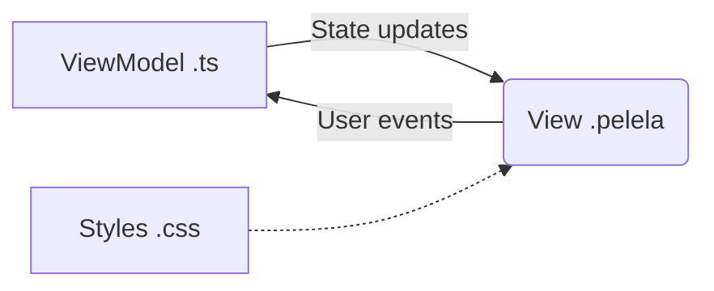
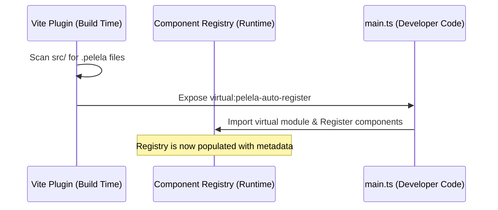
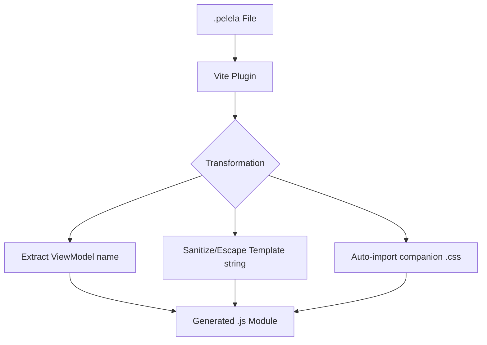
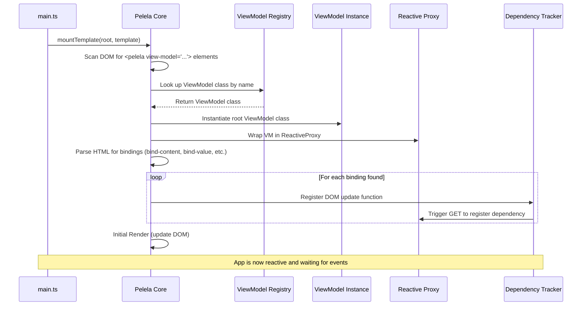

# Architecture & Lifecycle

PelelaJS is designed around a strictly enforced **Model-View-ViewModel (MVVM)** architectural pattern. The core philosophy is that the Model (the domain logic and state) is the single source of truth, and the View simply reflects it declaratively.

## The Component Triad

Every PelelaJS component is conceptually composed of three parts:

1. **`.pelela` (The View)**: The declarative HTML-like template. It contains bindings but no programmatic code.

2. **`.ts` (The ViewModel / Controller)**: The TypeScript file containing the class that manages the state, behavior, and lifecycle of the component.

3. **`.css` (The Styles)**: Optional styling associated with the component.

*Pros:*

- **Separation of Concerns:** Clear boundary between logic and presentation.

- **Conceptual Clarity:** Easier for students to reason about state vs. DOM.

*Cons:*

- **File Verbosity:** Requires multiple files per component compared to single-file components (SFCs) like in Vue or Svelte.

## The Build-time Engine (Vite Plugin)

The developer experience in PelelaJS relies heavily on a custom Vite plugin that bridges the gap between declarative templates and the JavaScript runtime. This engine handles two critical tasks: discovery and transformation.

### 1. Auto-discovery & Registration

PelelaJS favors convention over configuration. The plugin scans the `src/` directory for `.pelela` files and dynamically generates a **Virtual Module** (`virtual:pelela-auto-register`).

- **Mechanism:** This virtual module contains the necessary `import` statements and calls to the `ComponentRegistry`.

- **Effect:** By simply importing this virtual module in the application's `main.ts`, all components and routes are automatically wired up.

### 2. Source Transformation

Since browsers cannot natively execute `.pelela` files, the plugin transforms them into standard JavaScript modules on-the-fly.

**Key Outputs:**

- **Default Export**: The sanitized HTML template string.

- **Named Export (`viewModelName`)**: The identifier of the TypeScript class associated with this view.

- **CSS Side-effect**: An automatic `import "./filename.css"` if the file exists.

## Application Lifecycle

The framework lifecycle is designed to be as invisible as possible, managing the transition from static templates to a reactive DOM.

### The Bootstrapping Flow

The following diagram illustrates the sequence of events when a PelelaJS application is initialized.

### Responsibility Overview

The bootstrapping process is a collaborative effort between several core modules:

- **Pelela Core (`bootstrap`)**: Orchestrates the entire flow. It starts by initializing the internationalization system and scanning the DOM for `<pelela>` elements with a `view-model` attribute.

- **Component Registry**: Acts as the framework's knowledge base. It provides the HTML template and the ViewModel class associated with a specific component name, previously populated by the Vite plugin's auto-registration.

- **Reactive Proxy**: Once a ViewModel is instantiated, the Core wraps it in a Proxy. Its responsibility is to intercept every `set` operation on the state and notify the subscribers.

- **Dependency Tracker & Selective Rendering**: During the initial template parsing, the framework identifies every binding (`bind-content`, `bind-value`, etc.). It creates an update function for each one and registers it in the **Dependency Tracker**. By triggering a "dummy" `get` operation on the proxy during setup, the tracker automatically links each DOM node to its corresponding state property, ensuring that subsequent updates are surgical and high-performance.