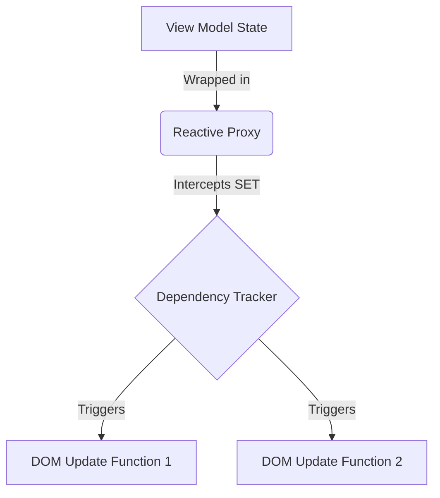
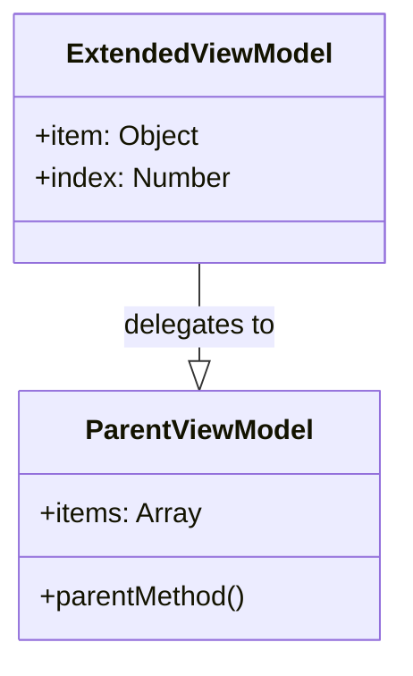

# Binding & Reactivity Mechanism

PelelaJS uses a fine-grained reactivity system based on JavaScript `Proxy` objects. The goal is to minimize re-renders by updating only the exact DOM nodes that depend on a changed piece of state.

## The Reactivity Core

At the heart of the system are two main actors:

1. **`ReactiveProxy`**: Wraps the ViewModel state. It intercepts `get` and `set` operations.

2. **`DependencyTracker`**: Keeps a mapping between state properties (keys) and the DOM update functions (subscribers) that rely on them.

When a template is parsed, any interpolation or binding reads from the `ReactiveProxy`. The `get` trap is triggered, allowing the `DependencyTracker` to register the current DOM update function as a subscriber to that specific property.

## Binding Types

The framework supports distinct binding mechanisms to connect the View to the ViewModel:

### 1. One-Way Binding (Model -> View)

Updates flow exclusively from the model to the view. Used by directives like `bind-content` (text), `bind-class` (CSS classes) and `bind-style` (inline styles).

- **Mechanism:** The DOM node is subscribed to the property's changes. When the property updates, the DOM node's `textContent` or attribute is overwritten.

### 2. Two-Way Binding (Model <-> View)

Typically used in input elements (`bind-value="user.name"`).

- **Mechanism:** It sets up a One-Way binding (Model -> View) for the visual representation, and simultaneously attaches a native DOM event listener (like `input` or `change`) to the element. When the event fires, the framework updates the model, completing the cycle.

### 3. Event Binding (View -> Model)

Used to trigger ViewModel methods from user actions (`click="submit()"`).

- **Mechanism:** The framework parses the event name and attaches a standard `addEventListener` to the DOM node, delegating the execution context to the ViewModel instance.

## Nested Properties Reactivity

A critical architectural challenge is handling deep state objects (e.g., `user.address.street`).

PelelaJS intercepts access to nested objects and dynamically wraps them in proxies on-the-fly. 

When a nested property is updated, the path is resolved recursively. The `DependencyTracker` ensures that a change in `user.address.street` triggers subscribers listening specifically to that path, without re-rendering everything that depends on the broader `user` object.

## Programmatic Code Interpolation (`if` and `for-each`)

Structural directives dynamically modify the DOM tree rather than just updating attributes or text.

### Conditional Rendering (`if`)

- **Mechanism:** The framework evaluates the condition against the state. If false, the DOM node is replaced by a placeholder (usually a comment node `<!-- pelela-if -->`) to remember its position. When the state changes and the condition becomes true, the node is re-instantiated and inserted back in place of the placeholder.

### Sequence Rendering (`for-each`)

- **Mechanism:** The framework acts as a factory. It takes the inner template of the `for-each` block and iterates over the array provided by the model. For each item, it creates a new **Child Context** (an `ExtendedViewModel`) that prototypically delegates to the parent ViewModel but overrides the loop variable. This ensures that expressions inside the loop can access both the local item and the parent's state securely.

