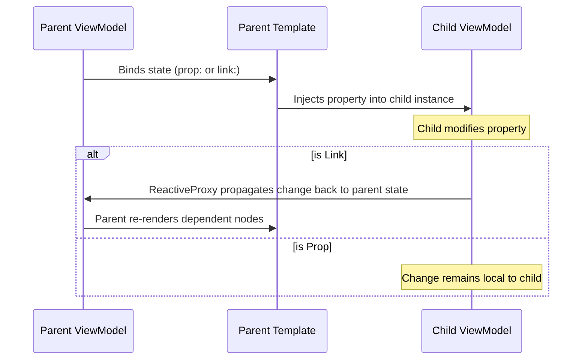
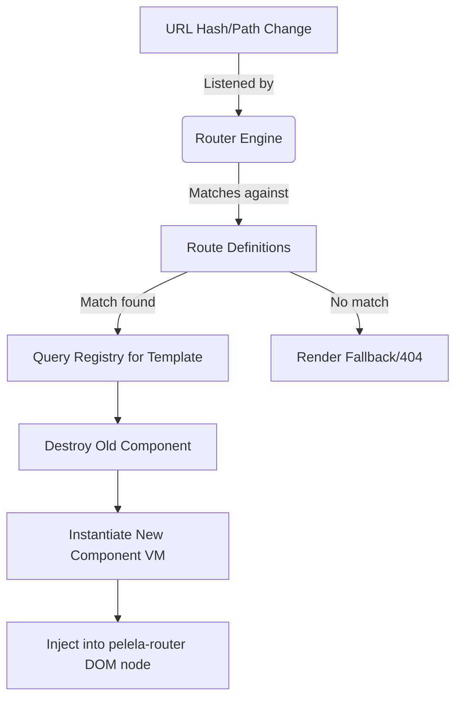

# Components & Routing

PelelaJS promotes modularity through components, treating both reusable UI fragments and entire pages as the same underlying entity.

## Component Architecture

A component in PelelaJS encapsulates a self-contained View and ViewModel. When the framework encounters a custom HTML tag in a template (e.g., `<user-profile>`), it resolves it using the `ComponentRegistry`.

### Parent-Child Communication

Data flow between components is handled strictly through state synchronization, maintaining a single source of truth within the reactive tree.

1. **One-Way Binding (`prop-key`)**: Data flows exclusively from the parent to the child. The child receives the property and its updates, but any change to the child's property will not affect the parent.

2. **Two-Way Binding (`link-key`)**: Synchronizes the state between parent and child. Changes in the parent's property are reflected in the child, and importantly, if the child modifies its own property, the change is automatically propagated back to the parent. This mechanism replaces the need for custom events for most common interactions.



## Routing Mechanism

Routing in PelelaJS is a dynamic component rendering system managed by the `Router` engine. It maps URL paths to ViewModel classes, allowing for single-page application (SPA) navigation.

### Defining Routes

Routes are defined in a centralized `routes.ts` file (or similar) as an array of `RouteDefinition` objects.

- **`path`**: The URL pattern to match. Supports parameters (e.g., `/users/:id`) and catch-all wildcards (`*`).

- **`component`**: The **ViewModel class** to be instantiated when the path matches. The framework automatically retrieves the associated template from the `ComponentRegistry`.

*Example `routes.ts`:*

```typescript
import { Home } from './src/home';
import { UserDetail } from './src/detail';

export const routes = [
  { path: '/', component: Home },
  { path: '/users/:id', component: UserDetail },
  { path: '*', component: Home } // Fallback
];
```

### High-Level Matching Logic

The `Router` uses a "First Match Wins" strategy, evaluating definitions in the order they are provided in the array.

- **Exact Matching**: Paths like `/` or `/about` are matched literally against the URL.

- **Dynamic Parameters (`:id`)**: Any segment starting with a colon is treated as a variable. Internally, the router converts this into a regular expression that matches any sequence of characters except a forward slash (`/`). For a route `/users/:id`, a URL like `/users/42` will match, and the value `42` will be extracted as the `id` parameter.

- **Wildcard / Catch-all (`*`)**: The asterisk matches any character sequence, including slashes. It is designed as a fallback mechanism; if no other route matches, the wildcard route is selected. For this reason, **it should always be the last element in the routes array**.

### Accessing Route Parameters

Inside the ViewModel class (typically in the `constructor`), the developer can access the extracted parameters using the `router` API.

- **`router.urlParameters()`**: Returns an object containing the dynamic segments defined in the path (e.g., `{ id: '42' }`).

- **`router.searchParameters()`**: Returns an object containing the query string parameters from the URL (e.g., `?name=Leon` -> `{ name: 'Leon' }`).

*Example ViewModel usage:*

```typescript
import { router } from 'pelelajs';

export class UserDetail {
  userId = '';

  constructor() {
    const { id } = router.urlParameters();
    this.userId = id;
  }
}
```

### How it Works

The resolution process is handled by the internal **Router Engine**:

1. **The Router Outlet:** The root application defines a `<pelela-router>` tag, which acts as a placeholder for dynamic content.

2. **Path Resolution:** When the browser URL changes (via History API), the Router parses the path and matches it against the provided `RouteDefinition` array using the logic described above.

3. **Component Retrieval:** Once a match is found, the Router uses the ViewModel class to look up the corresponding template in the `ComponentRegistry`.

4. **Dynamic Swapping:** The current component inside the `<pelela-router>` is destroyed (cleaning up its subscriptions in the `DependencyTracker`), and the new matched component is instantiated and injected.



This design keeps the developer experience declarative, minimizing the need for manual setup while still allowing complex single-page application (SPA) architectures.
