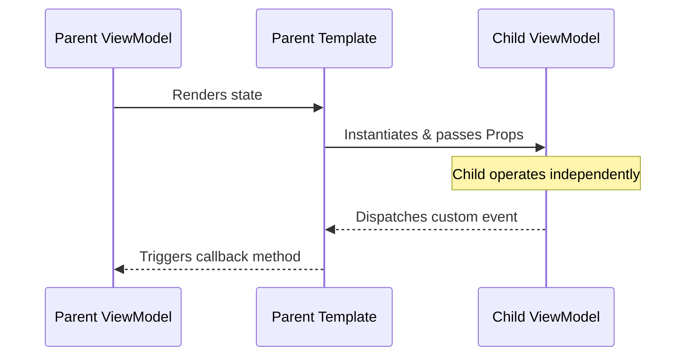
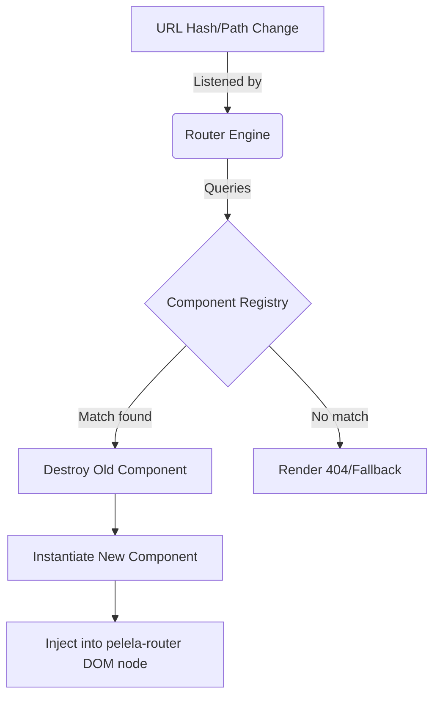

# Components & Routing

PelelaJS promotes modularity through components, treating both reusable UI fragments and entire pages as the same underlying entity.

## Component Architecture

A component in PelelaJS encapsulates a self-contained View and ViewModel. When the framework encounters a custom HTML tag in a template (e.g., `<user-profile>`), it resolves it using the `ComponentRegistry`.

### Parent-Child Communication

Data flows in PelelaJS maintain a clear hierarchy to avoid tangled reactivity chains.

1. **Props (Parent -> Child):** The parent binds data to the child component via attributes (`<user-profile user="selectedUser">`). The framework initializes the child's ViewModel and injects these properties before its initial render.

2. **Events (Child -> Parent):** To communicate upwards, children do not mutate parent state directly. Instead, they dispatch custom events, and the parent listens to them (`<user-profile onUserDeleted="refreshList()">`).

## Routing Mechanism

Routing in PelelaJS is fundamentally a dynamic component rendering system. Instead of explicitly mapping URLs to component classes in a configuration object, the framework relies on convention-based auto-registration.

### How it Works

1. **The Router Outlet:** The root application defines a `<pelela-router>` tag, which acts as a placeholder for dynamic content.

2. **Path Resolution:** When the browser URL changes (via History API), the internal Router parses the path.

3. **Component Matching:** The Router queries the `ComponentRegistry` for a component whose registered route matches the current path.

4. **Dynamic Swapping:** If a match is found, the current component inside the `<pelela-router>` is destroyed (cleaning up its subscriptions in the `DependencyTracker`), and the new matched component is instantiated and injected.

This design keeps the developer experience declarative, minimizing the need for manual setup while still allowing complex single-page application (SPA) architectures.
