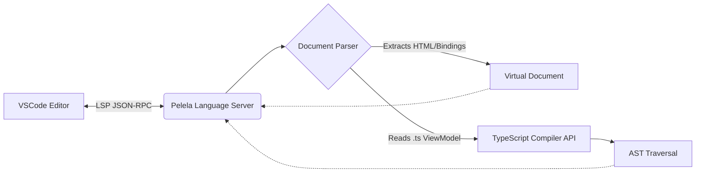

# VSCode Extension Architecture

The PelelaJS extension provides Language Server Protocol (LSP) features to enhance developer productivity when working with `.pelela` templates.

## Core Features

The extension is designed to bridge the gap between the declarative `.pelela` template and the underlying `.ts` ViewModel, providing:

- **Syntax Highlighting:** Custom grammar rules for Pelela-specific syntax (e.g., `{{ }}`, `bind:`, `(click)`).

- **Autocomplete & Intellisense:** Intelligent suggestions for model properties and methods inside the template.

- **Go to Definition:** Navigating from a bound property in the template directly to its declaration in the TypeScript file.

## Architectural Overview

The extension operates as a standard VSCode Language Client/Server model.

### The Parsing Mechanism

To provide intelligent feedback, the Language Server must understand both the HTML-like structure of the View and the TypeScript AST (Abstract Syntax Tree) of the ViewModel.

1. **Document Synchronization:** As the user types in a `.pelela` file, the server receives text document synchronization events.

2. **Context Resolution:** When a user requests autocomplete or definition (e.g., hovering over `{{ user.name }}`), the server identifies the exact position in the document.

3. **TypeScript Integration:** The server uses the TypeScript Compiler API to analyze the companion `.ts` file. It traverses the AST to find public properties, methods, and types defined within the ViewModel class.

4. **Mapping:** It maps the token found in the template (e.g., `user.name`) to the corresponding AST node in the ViewModel, returning the required LSP response (like a `Location` or a list of `CompletionItem`s).

## Developing the Extension

When adding new features:

- Leverage existing parsing utilities rather than writing custom Regex for complex TypeScript structures.

- Ensure the extension fails gracefully. If a `.ts` file has syntax errors, the language server should degrade without crashing.
