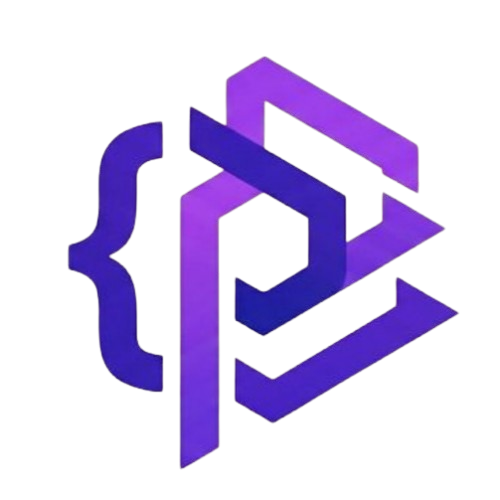

<p align="center">
  
</p>

<p align="center">
  <a href="https://www.npmjs.com/package/pelelajs"></a>
  <a href="https://www.npmjs.com/package/pelelajs"></a>
  <a href="https://github.com/uqbar-project/pelelajs/actions/workflows/ci.yml"></a>
  <a href="https://codecov.io/gh/uqbar-project/pelelajs"></a>
</p>

# PelelaJS

**PelelaJS** is a didactic UI framework designed for learning Web Programming. It focuses on clarity, simplicity, and the Model-View-Controller (MVC) pattern.

## Features

- 🧩 **Declarative Bindings**: Easily link your Model to the DOM.
- 🔄 **Reactivity**: Automatically update the UI when the state changes.
- 🛣️ **Routing**: Simple, file-based routing support.
- 🛠️ **CLI Support**: Bootstrap new projects in seconds with `pelela init`.
- 🔌 **Vite Integration**: First-class support for modern build tools.

## Getting Started

### Initialize a new project

The easiest way to start is using our CLI:

```bash
pnpm add -g pelelajs
pelela init my-app
cd my-app
pnpm install
pnpm dev
```

### Manual Installation

```bash
pnpm add pelelajs
```

## Documentation

For full documentation and examples, please visit the [GitHub Repository](https://github.com/uqbar-project/pelelajs).

---
Developed with ❤️ by the **Uqbar Project**.
